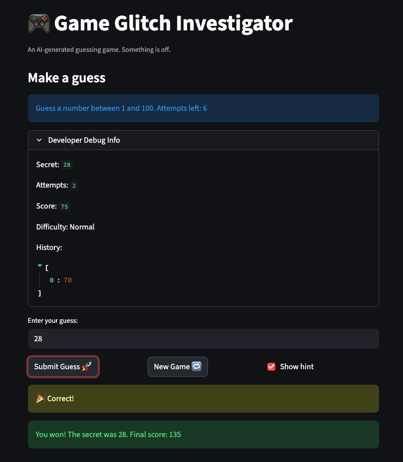

# 🎮 Game Glitch Investigator: The Impossible Guesser

## 🚨 The Situation

You asked an AI to build a simple "Number Guessing Game" using Streamlit.
It wrote the code, ran away, and now the game is unplayable. 

- You can't win.
- The hints lie to you.
- The secret number seems to have commitment issues.

## 🛠️ Setup

1. Install dependencies: `pip install -r requirements.txt`
2. Run the broken app: `python -m streamlit run app.py`

## 🕵️‍♂️ Your Mission

1. **Play the game.** Open the "Developer Debug Info" tab in the app to see the secret number. Try to win.
2. **Find the State Bug.** Why does the secret number change every time you click "Submit"? Ask ChatGPT: *"How do I keep a variable from resetting in Streamlit when I click a button?"*
3. **Fix the Logic.** The hints ("Higher/Lower") are wrong. Fix them.
4. **Refactor & Test.** - Move the logic into `logic_utils.py`.
   - Run `pytest` in your terminal.
   - Keep fixing until all tests pass!

## 📝 Document Your Experience

- [x] **Describe the game's purpose.**  
  This is a Streamlit-based number guessing game where players try to guess a secret number within a range determined by difficulty level (Easy: 1-20, Normal: 1-100, Hard: 1-50). The game includes scoring based on attempts, hint system to guide players, and a developer debug panel. The purpose is to teach debugging and refactoring skills by fixing deliberately buggy AI-generated code.

- [x] **Detail which bugs you found.**  
  1. **Inverted hints**: The game said "Go HIGHER!" when the guess was too high and "Go LOWER!" when the guess was too low.  
  2. **Type conversion bug**: On even-numbered attempts, the secret number was converted to a string, breaking comparisons and making the game unpredictable.  
  3. **New game button issues**: The button didn't reset game state properly - it used wrong ranges, didn't clear status/history, and set attempts to 0 instead of 1.  
  4. **Mixed UI and logic**: Game logic was embedded in the Streamlit app file, making it hard to test and maintain.

- [x] **Explain what fixes you applied.**  
  1. **Fixed inverted hints**: Corrected the logic in `check_guess()` to properly identify high/low guesses.  
  2. **Removed type conversion**: Eliminated the string conversion of the secret number to ensure consistent integer comparisons.  
  3. **Fixed new game button**: Updated the button handler to properly reset all session state variables, use correct difficulty ranges, and set appropriate initial values.  
  4. **Refactored code**: Moved all game logic functions (`get_range_for_difficulty`, `parse_guess`, `check_guess`, `update_score`, `get_attempt_limit`) to `logic_utils.py` for better separation of concerns. Added comprehensive unit tests in `tests/test_game_logic.py` covering all functions and edge cases.

## 📸 Demo

- 

## 🚀 Stretch Features

- [ ] [If you choose to complete Challenge 4, insert a screenshot of your Enhanced Game UI here]
